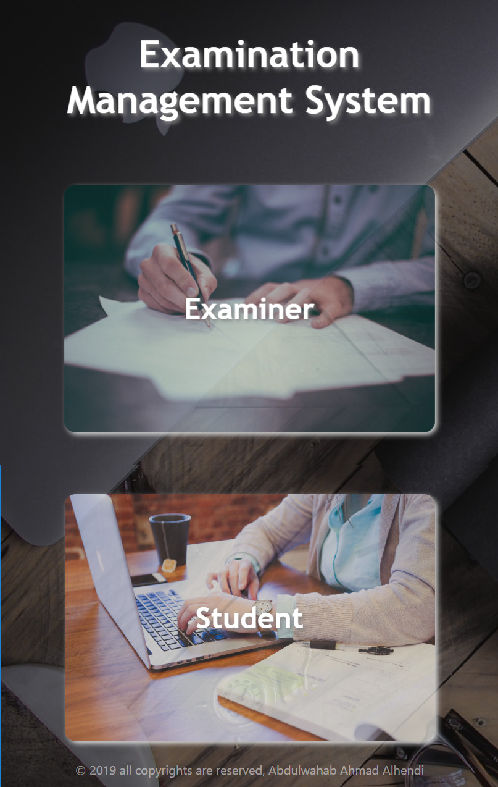

# Online-EMS
Online Examination Management System

Examination Management System (EMS) is the all-in-one solution for managing exams at your institution.
Optimise your students’ experience by reducing the operational risks which exams produce.
Save time and money in the examination process.

<h5># As an Examiner, you can:</h5> 
- Add / Updata / Remove an exam. 
- Managing questions effictivley in each exam in which you can add / update / delete questions in the exam. 
- Show the exam information & questions list in the final version. 
- A Table containes all created exams so that easily you can access and manage any exam. 
- A Table shows all students scores in all exams.

<h5># Main Features in my (EMS):</h5> 
- Perfect validation by using Regular Expressions.  
- Email verification for student account activation. 
- AJAX for best User Experaince. 
- Using Sessions and Encrypted passwords to support the security issues. 
- Nice UX/UI specially when using Sweet Alert javaScript library. 
- Responsivess abiliry in which the website response to any device screen size.

-----------------------------------------------------------------------------------------------

<h5># Screenshots for EMS main page</h5>

<h5># Showing the responsiveness from a mobile device</h5>

